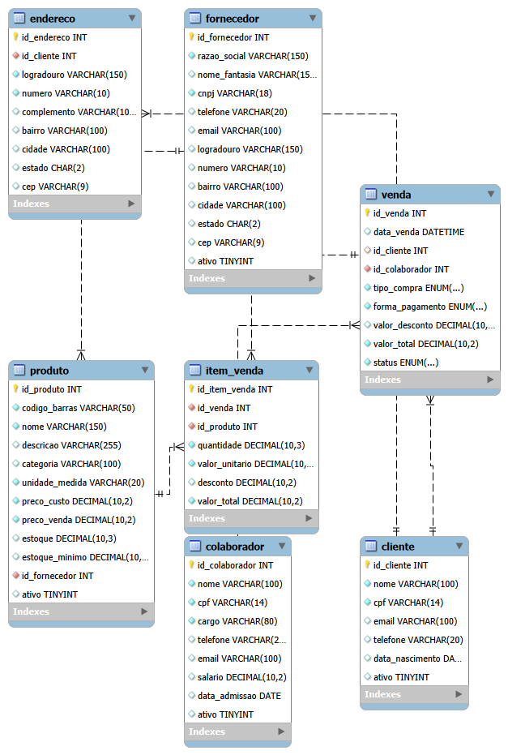

# Sistema de Banco de Dados para Supermercado

Este repositório contém a arquitetura de banco de dados relacional e a modelagem lógica para o gerenciamento completo de um **Supermercado**. O projeto abrange desde o controle de cadastros base até a extração de relatórios analíticos de inteligência de negócios.
O modelo e os scripts foram testados e validados no ambiente **MySQL 8.0**.
---
## Modelagem do Sistema
O projeto conta com 7 entidades centrais totalmente interconectadas com integridade referencial (`ON UPDATE CASCADE` e `ON DELETE RESTRICT/CASCADE`):
1. **`cliente`**: Armazena dados cadastrais dos consumidores (como CPF único).2. **`endereco`**: Relacionamento 1:N com clientes, permitindo múltiplos endereços por usuário.3. **`colaborador`**: Registro de funcionários, cargos, dados de admissão e salários.4. **`fornecedor`**: Mapeamento de parceiros comerciais e dados de contato/CNPJ corporativo.5. **`produto`**: Controle de itens, códigos de barras únicos, preços de custo/venda e níveis de estoque dinâmico.6. **`venda`**: Registro centralizado de transações financeiras.7. **`item_venda`**: Tabela associativa que discrimina os produtos e quantidades de cada venda (Relacionamento N:N).
---
## Regras de Negócio Implementadas no Código
* **Modalidades de Compra Flexíveis:** Mapeadas nativamente via `ENUM` (`PRESENCIAL`, `ONLINE`, `DELIVERY`, `RETIRADA`).* **Diversidade de Pagamentos:** Suporte estruturado para `DINHEIRO`, `CARTAO`, `PIX`, `VALE_REFEICAO` e `VALE_ALIMENTACAO`.* **Segurança e Auditoria Estrita:** Uso de restrições `UNIQUE` em campos cruciais como CPF, CNPJ e Códigos de Barras para mitigar duplicidades no sistema.* **Exclusão Lógica:** Implementação do campo `ativo (BOOLEAN)` nas tabelas de cadastro para desativação segura sem quebra de histórico financeiro.
---
## Relatórios de Inteligência de Negócio (BI) Incluídos
O script já possui consultas prontas de agregação para tomada de decisões administrativas:* **Faturamento Total:** Soma do valor líquido de vendas consolidadas.* **Ticket por Forma de Pagamento:** Análise de canais financeiros ordenados por faturamento.* **Alerta de Estoque Baixo:** Filtro dinâmico para produtos que atingiram ou operam abaixo do `estoque_minimo`.* **Curva ABC de Produtos:** Ranking dos itens mais vendidos e faturamento gerado por mercadoria.* **Performance de Equipe:** Totalização de vendas e metas atingidas por colaborador.
---
## Organização dos Arquivos
* `Supermercado.SQL`: Script SQL contendo a estrutura de criação do banco (`DDL`), inserção de dados de simulação (`DML`) e as consultas analíticas de relatórios.* `Modelo_logico_Supermercado.mwb`: Diagrama Entidade-Relacionamento (EER) nativo do MySQL Workbench que ilustra visualmente o mapeamento lógico das tabelas.
---
## Como Reproduzir este Projeto
1. Baixe ou clone os arquivos deste repositório na sua máquina local.2. Certifique-se de possuir o **MySQL Server 8.0** configurado.3. Abra o **MySQL Workbench 8.0** (versão clássica com suporte a diagramas).4. Para criar a estrutura e carregar os dados de teste, abra o arquivo `Supermercado.SQL` em uma aba de consulta e clique no ícone do **Raio** para executar.5. Para analisar e editar o design visual das tabelas, vá em *File > Open Model* e selecione o arquivo `Modelo_logico_Supermercado.mwb`.
---Desenvolvido com foco em boas práticas por [Matheus Sergio nicky Nascimento]
